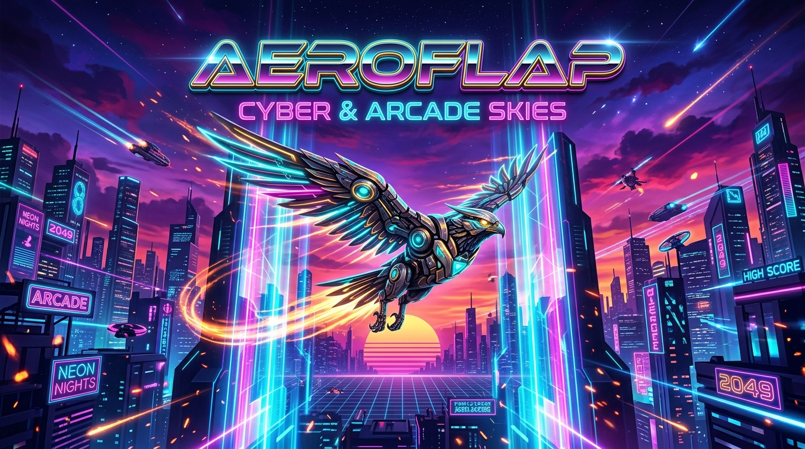

<div align="center">



# 🚀 AeroFlap: Cyber & Arcade Skies

**A next-generation, cyberpunk-infused arcade flight experience with customizable obstacles, unlockable character skins, biometric passkeys, real-time audio synthesis, and cloud sync.**

[](https://LIN4CRE.github.io/AeroFlap/)
[](https://LIN4CRE.github.io/AeroFlap/)
[](https://linacre.site)

<br/>

[](https://react.dev/)
[](https://www.typescriptlang.org/)
[](https://vitejs.dev/)
[](https://tailwindcss.com/)
[](./LICENSE)

[**🕹️ Play Online**](https://LIN4CRE.github.io/AeroFlap/) • [**✨ Features**](#-key-features) • [**🎮 Controls**](#-controls--gameplay) • [**🛠️ Tech Stack**](#-tech-stack) • [**🚀 Getting Started**](#-getting-started) • [**🌐 linacre.site**](https://linacre.site)

---

</div>

## 🌌 Overview

**AeroFlap** takes the addictive rhythm of classic flappy flight mechanics and catapults it into an electrified synthwave multiverse. Built with **React 19**, **Vite**, **TypeScript**, and **Tailwind CSS v4**, AeroFlap runs natively at 60+ FPS on any screen—from flagship ultra-wide desktop monitors to touch-enabled mobile devices.

Soar between holographic cyber-pillars, gather celestial feathers, complete daily contracts, unlock legendary avian mechs, and etch your callsign into the global hall of fame.

---

## ✨ Key Features

### 🪶 10 Unlockable Skins & Particle Trails
Each skin features distinct particle engines, sound pitch alterations, and rarity tiers:
- **Classic Canary** — The legendary golden pioneer of the skies.
- **Cyber Mech-01** — Dual ion thrusters with aerodynamic carbon plating & laser trails.
- **Solar Phoenix** — Born from solar embers with incandescent blazing contrails.
- **Golden Monarch** — 24k celestial gold with royal diamond shimmer.
- **8-Bit Retro Bird** — Nostalgic 1984 pixel styling with chiptune resonance.
- **Void Raven** — Cosmic violet stardust shedding through dimensional shadows.
- **Steampunk Owl** — Clockwork brass wings, aviator goggles, and steam exhausts.
- **Phantom Spirit** — Ethereal vapor drifting smoothly through obstacles.
- **Kawaii Pip** — Heart-bursting cheerful arcade companion.
- **Celestial Saucer** — Anti-gravity tractor rings and alien harmonics.

### ⚡ Dynamic Obstacle Customizer
- Fine-tune gap spacing, scroll velocities, obstacle varieties, and hazard density.
- Real-time physics engine with pixel-accurate bounding box collisions.

### 📜 Quests, Leveling & Feather Economy
- Dynamic mission system: Daily quests, weekly milestones, and lifetime badges.
- Earn feather currency to unlock legendary cosmetics and sound profiles.

### 🔐 Biometric Passkeys & Zero-Friction Auth
- Modern **WebAuthn Biometric Passkeys** (Touch ID, Face ID, Windows Hello) support.
- Encrypted local-first backup with cloud synchronization.

### 🎵 High-Octane Web Audio Synthesizer
- Fully synthesized procedural sound effects (flaps, scoring chimes, impact crashes) built using the Web Audio API—zero external audio file latency.
- Tactile vibration feedback (haptics) on supported mobile devices.

### 📊 Instant Shareable Scorecards
- High-res HTML5 Canvas scorecard generator for export to Discord, Twitter/X, and social feeds with one tap.

---

## 🎮 Controls & Gameplay

| Action | Desktop Controls | Mobile / Touch |
| :--- | :--- | :--- |
| **Flap / Ascend** | `Spacebar` / `Up Arrow` / `Left Click` | Single Tap anywhere on screen |
| **Pause / Resume** | `P` / `Escape` | Pause button in Top Navigation |
| **Restart Game** | `Spacebar` (Game Over screen) | Tap "Re-Fly" button |
| **Navigate Tabs** | Keyboard shortcuts or mouse | Bottom Navigation Bar |

---

## 🛠️ Tech Stack

```
AeroFlap/
├── Frontend Core      React 19 + TypeScript (Strict Type Safety)
├── Build Tooling      Vite 8.3 + ESBuild (Ultra-fast HMR & bundling)
├── Styling System     Tailwind CSS v4 (Modern CSS theme engine)
├── Physics & Canvas   Custom 60FPS Canvas 2D Game Engine
├── Audio Engine       Web Audio API (Procedural Synthesizer)
├── Icons & Motion     Lucide Icons + Motion (Framer Motion Engine)
└── Deployment         GitHub Pages + Vercel + linacre.site CDN
```

---

## 🚀 Getting Started

### Prerequisites
- [Node.js](https://nodejs.org/) v20+ or [Bun](https://bun.sh/) v1.2+

### Installation & Run

```bash
# 1. Clone the repository
git clone https://github.com/LIN4CRE/AeroFlap.git
cd AeroFlap

# 2. Install dependencies (using Bun or npm)
bun install
# or: npm install

# 3. Launch development server
bun run dev
# or: npm run dev
```

Open [http://localhost:3000](http://localhost:3000) in your browser.

### Production Build

```bash
# Build production bundle with optimized chunking
bun run build
# or: npm run build

# Preview production build locally
bun run preview
```

The optimized static assets will be compiled into the `dist/` directory.

---

## 🌐 Ecosystem & linacre.site Integration

AeroFlap is part of the **Linacre Digital Ecosystem**:

* **Standalone GitHub Pages:** [https://LIN4CRE.github.io/AeroFlap/](https://LIN4CRE.github.io/AeroFlap/)
* **Platform Portal:** [https://linacre.site](https://linacre.site)
* **Author / Developer:** [LIN4CRE (GitHub)](https://github.com/LIN4CRE)

---

## 📄 License

This project is licensed under the **MIT License** — feel free to modify, distribute, and build upon it.
See [LICENSE](./LICENSE) for details.

<div align="center">
  <sub>Crafted with ⚡ by <a href="https://github.com/LIN4CRE">LIN4CRE</a> • Part of the <a href="https://linacre.site">linacre.site</a> Network</sub>
</div>
